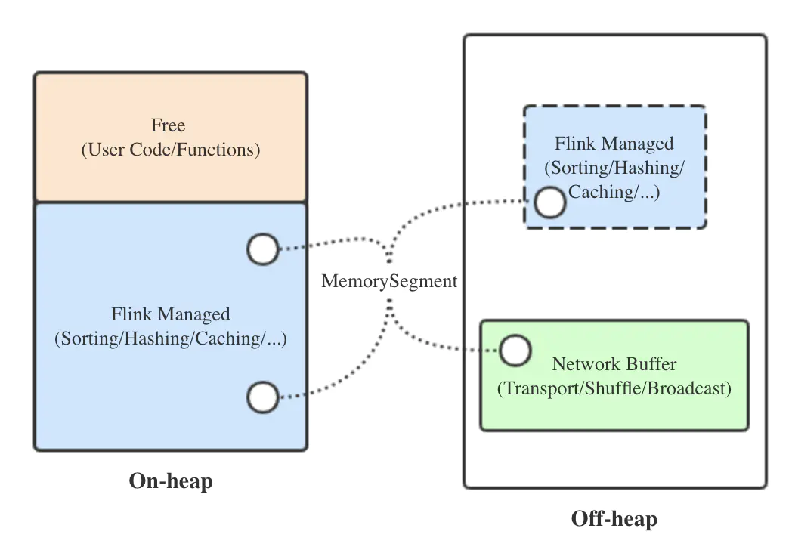
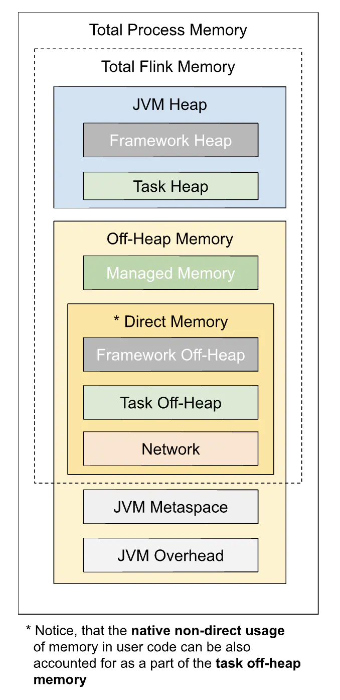

### 内存管理

先来看一下Flink中TaskManager的内存布局：

Flink为了减少对象存储开销，会先将对象进行序列化后再进行存储，序列化存储的最小单位是MemorySegment，底层的实现是数组，大小由taskmanager.memory.segment-size
配置项指定，默认32KB。下面分别进行介绍：
  * 网络缓存(Network Buffer)：用于进行网络传输及网络相关的操作(如shuffle、broadcast等)的内存块，由MemorySegment组成，自Flink 1.5版本开始，网络缓存固定分
  配在堆外，这样可以充分利用零拷贝等技术;

  * 托管内存：用于Flink内部所有算子逻辑的内存分配，及中间数据的存储，同样是由MemorySegment组成，通过Flink的MemoryManager组件进行管理。默认堆内分配，如果开启
  堆外内存分配的开关，也可以在堆外、堆内同时进行分配。相比于Spark，它没有对存储内存和执行内存进行区分，所以也更加的灵活;

  * 空闲内存：实际上用于存储用户代码和数据结构，固定分配在堆内，一般可以认为堆内内存减去托管内存后剩下的就是空闲内存;

YARN部署的per job集群的启动调用的是YarnClusterDescriptor.deployJobCluster()方法，其中的ClusterSpecification对象持有该集群的3个基本参数：JobManager内存
大小、TaskManager内存大小、每个TaskManager的slot数量，deployInternal()方法在其中调用YarnClusterDescriptor.validateClusterResources()方法对资源进行校
验。clusterSpecification.getMasterMemoryMB()返回的是JobManager的内存，默认是768MB，可以通过参数jobmanager.heap.size设置。clusterSpecification.getTaskManagerMemoryMB()
返回的是TaskManager的内存，默认是1024MB，可以通过参数taskmanager.heap.size设置。

以上是Flink1.10版本之前的内存管理方案，其实际上的配置比较复杂，有很多隐藏的细节需要注意，并且对于批处理作业和流处理作业分别有一套不同的配置方法，因此社区一直在探究
并提出了一套新的统一的内存模型和配置，并在Flink 1.10版本中进行了发布。下面就让我们来分析下吧，先来看下新的内存布局：

由上图可以看出，与老版本的内存模型还是有很大的区别的，下面分别进行介绍：
  * Flink总内存：TM所占用的所有与Flink相关的内存，包括位于堆内和堆外的Flink框架内存、位于堆外的托管内存、位于堆外的网络缓存、位于堆内和堆外的任务内存，由参数
  taskmanager.memory.flink.size设置;

  * Flink框架内存：位于堆内和堆外，它是Flink运行时占用的内存，一般不需要调整，由参数taskmanager.memory.framework.heap.size控制堆内部分的大小，参数
  taskmanager.memory.framework.off-heap.size控制堆外部分的大小，它们的默认值都是128MB;

  * 托管内存：仅位于堆外，由MemoryManager进行管理，主要用于缓存中间数据和RocksDB状态后端的数据存储，既可以通过参数taskmanager.memory.managed.fraction
  控制其占Flink总内存的比例来控制其大小(默认0.4)，也可以直接通过参数taskmanager.memory.managed.size直接指定其大小;

  * 网络缓存：仅位于堆外，主要用于TM之间及与外部组件的数据交换，可以通过参数taskmanager.memory.network.fraction控制其占Flink总内存的大小比例，还可以通过参数taskmanager.memory.network.min
  和taskmanager.memory.network.max控制其大小上下限，以免分配得过多或过少;

  * 任务内存：位于堆外和堆外，被用户代码和自定义数据结构所使用，堆内部分通过参数taskmanager.memory.task.heap.size设置，堆外部分通过参数taskmanager.memory.task.off-heap.size设置;

  * TaskManager总内存：它是Flink总内存、JVM元空间与JVM额外内存大小之和，也就是容器本身的内存大小，由参数taskmanager.memory.process.size设置;

  * JVM元空间：也就是JDK1.8以前的HotSpot JVM的方法区，或者叫做永久代，由参数taskmanager.memory.jvm-metaspace.size设置;

  * JVM额外开销：预留的其他本地内存，主要用于线程栈、代码缓存等，避免出现异常;

虽然经过了Flink 1.10版本的优化，看上去还是有一大堆参数需要设置啊，完全记不住怎么办？没关系，其实要设置的很少。一般来说，如果部署方式是Standalone，就需要通过参数
taskmanager.memory.flink.size指定Flink的总内存，如果是k8s或是yarn、Mesos模式部署，就需要通过参数taskmanager.memory.process.size指定TM进程的总内存。如果
需要对参数进行调优，可以考虑先通过参数taskmanager.memory.network.fraction指定网络缓存的占比大小，然后通过参数taskmanager.memory.managed.fraction指定托管
内存占比大小，其余的参数都可以不设置。否则，硬性设置全部的参数容易出现考虑不周引发配额被抢占引起运行失败等异常情况！
